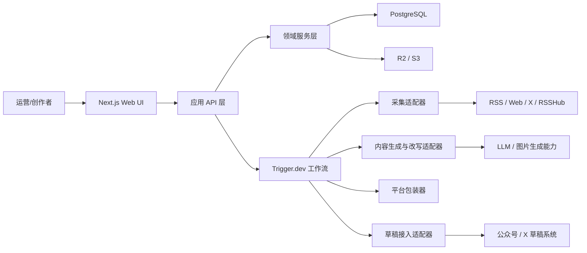

# Content Workbench 系统架构总览

## 1. 目标

本文档描述 `Content Workbench` MVP 的系统边界、模块职责、关键数据流、状态约束和失败处理方式。

目标是让后续开发在没有代码的前提下，也能先对以下问题达成一致：

- 主链路由哪些模块组成
- 哪些操作走同步请求，哪些操作走异步工作流
- 哪些状态变化必须受审核规则约束
- 采集、生成、包装、导出之间如何解耦

## 2. 需求摘要

### 功能需求

- 定时采集 RSS、网页、X 等热点源
- 对原始素材执行清洗、去重、聚类、打分
- 将选题推进到母稿生成、改写、多平台包装
- 支持人工审核、退回、重新提交
- 为公众号、小红书、X 长文生成发布准备包
- 支持回填平台草稿链接和最终发布链接

### 非功能需求

- 可回溯：任何内容都能回链到原始素材和历史版本
- 幂等性：定时采集和导出任务允许重复触发但不能重复入库
- 安全性：发布前必须经过人工审核
- 可观测性：关键任务必须记录输入、输出、状态和失败原因
- 低运维复杂度：MVP 以单体应用加工作流编排为主，不拆微服务

### 约束

- 团队配置按 `1-2` 名工程师设计
- 第一阶段不做自动发布闭环
- 第一阶段只聚焦 `WECHAT`、`XHS`、`X_ARTICLE`
- 以 `Next.js + PostgreSQL + Trigger.dev` 为实现主干

## 3. 架构结论

MVP 采用“模块化单体 + 异步工作流”的架构：

- Web UI、API、领域逻辑放在同一个 `Next.js` 代码库
- 采集、生成、改写、包装、导出由 `Trigger.dev` 编排后台任务
- `PostgreSQL` 保存业务状态与审计链路
- 对象存储保存图片、导出包和大体积产物
- 外部能力通过适配器层接入，避免业务层直接耦合第三方实现

这个选择的核心理由是：MVP 的难点不在水平扩展，而在状态正确、链路清晰、失败可恢复。

## 4. 高层架构

## 5. 模块边界

### 5.1 Web UI

负责：

- 展示 Topics、Draft、Review、Publish、Dashboard、Settings 页面
- 发起人工动作，例如“开始写作”“触发改写”“审核通过”“导出发布包”
- 展示工作流状态、失败原因、重试入口

不负责：

- 直接调用第三方平台
- 承担复杂业务编排

### 5.2 API 层

负责：

- 参数校验
- 鉴权与权限预留
- 将同步请求映射为领域动作或异步任务触发
- 返回一致的资源结构和任务状态

不负责：

- 直接拼接复杂 prompt
- 直接实现聚类、改写、导出算法

### 5.3 领域服务层

负责：

- `TopicCluster`、`Draft`、`ReviewTask`、`PublishPackage` 等核心对象的状态流转
- 幂等规则、唯一性约束、跨表更新
- 审核门禁和发布准备门禁

这是系统真正的业务核心，后续测试也应优先覆盖这一层。

### 5.4 工作流层

负责：

- 定时采集
- 生成母稿
- 批量改写
- 多平台包装
- 导出发布包
- 创建远端草稿

工作流层只负责编排步骤，不直接保存复杂业务规则。状态判定仍回到领域服务层。

### 5.5 适配器层

包括：

- `Source Collector Adapter`
- `LLM Adapter`
- `Asset Generator Adapter`
- `Channel Draft Adapter`

适配器层的目标是把外部能力压缩成稳定接口，让未来替换 `Agent-Reach`、`baoyu-skills` 或草稿服务时，不需要重写主流程。

## 6. 主链路数据流

### 6.1 热点采集

1. 定时任务读取 `Source`
2. 采集器拉取原始内容并写入 `SourceItem`
3. normalize 层补齐标准字段并计算 `dedupeHash`
4. 聚类任务更新 `TopicCluster` 及关联表
5. Topics 页面读取候选选题

### 6.2 内容生成

1. 用户将 `TopicCluster` 标记为 `IN_PROGRESS`
2. API 触发“生成母稿”任务
3. 工作流读取选题、来源素材、风格配置
4. 生成 `MASTER` 类型 `Draft`
5. 如需继续改写，创建 `RewriteVersion`

### 6.3 审核与发布准备

1. 用户从选中版本触发平台包装
2. 系统生成平台稿、素材和 `PublishPackage`
3. 稿件进入 `IN_REVIEW`
4. 审核通过后，稿件进入 `APPROVED` 或 `READY_TO_PUBLISH`
5. Publish 页面触发导出或草稿创建
6. 人工发布后回填 `PublicationRecord`

## 7. 状态约束

### 7.1 TopicCluster

- `NEW -> SHORTLISTED`
- `NEW/SHORTLISTED -> IN_PROGRESS`
- `NEW/SHORTLISTED -> IGNORED`
- 任意非 `ARCHIVED` 状态可进入 `ARCHIVED`

约束：

- 只有 `IN_PROGRESS` 选题才能触发母稿生成
- 同一选题允许多个 Draft，但必须至少有一个主稿

### 7.2 Draft

- `CREATED -> REWRITTEN`
- `CREATED/REWRITTEN -> PACKAGED`
- `PACKAGED -> IN_REVIEW`
- `IN_REVIEW -> APPROVED`
- `IN_REVIEW -> REJECTED`
- `APPROVED -> READY_TO_PUBLISH`

约束：

- 未进入 `PACKAGED` 的稿件不能创建 `PublishPackage`
- 未通过审核的稿件不能生成远端草稿
- 被退回后必须产生新的内容版本或重新提交记录，不能直接跳回 `APPROVED`

### 7.3 PublishPackage

- `PENDING -> EXPORTED`
- `PENDING/EXPORTED -> DRAFT_CREATED`
- `EXPORTED/DRAFT_CREATED -> PUBLISHED`
- 任意状态在外部失败时可进入 `FAILED`

## 8. 同步与异步边界

以下动作可以同步完成：

- 查询列表和详情
- 选题收藏、忽略、开始写作
- 审核通过、退回、回填发布链接

以下动作必须异步执行：

- 热点采集
- 聚类与打分
- 母稿生成
- 多轮改写
- 多平台包装
- 图片生成与导出包生成
- 创建远端草稿

判断原则是：凡是依赖外部系统、模型调用或处理时间不稳定的动作，一律异步。

## 9. 幂等与唯一性策略

- `SourceItem` 以 `sourceId + url` 保证单源唯一
- 同一条原始素材通过 `dedupeHash` 做跨源去重候选
- 母稿生成接口需要幂等键，避免重复点击产生多个无意义主稿
- `PublishPackage` 以 `draftId + channel` 唯一，MVP 阶段默认“每稿每渠道只有一个当前发布包”
- 导出和创建草稿任务应支持安全重试，重复执行优先覆盖产物元数据，不重复创建逻辑记录

## 10. 失败处理

### 10.1 可恢复失败

- 抓取超时
- 模型调用失败
- 对象存储上传失败
- 草稿创建失败

处理原则：

- 记录失败原因和最近一次尝试时间
- 保留已成功产物
- 支持任务级重试

### 10.2 不可静默恢复的失败

- 审核门禁被绕过
- 状态跳转非法
- 同一资源出现冲突写入

处理原则：

- API 直接返回错误
- 不做自动吞错
- 写结构化日志并阻断后续动作

## 11. 可观测性

必须记录以下维度：

- `jobId`
- `entityType`
- `entityId`
- `sourceId` 或 `channel`
- `status`
- `startedAt`
- `finishedAt`
- `errorCode`
- `errorMessage`

推荐最先补齐的观测面：

- 采集成功率
- 去重后有效素材数
- 母稿生成成功率
- 审核通过率
- 草稿创建成功率

## 12. 安全与权限预留

MVP 虽然不做复杂团队权限，但必须预留以下边界：

- 平台账号密钥只存在服务端
- 外部平台回调或草稿写入必须带服务端鉴权
- 审核动作需要保留操作者身份
- 所有富文本和 Markdown 导出前都要经过基本内容清洗

## 13. 后续拆分建议

当系统出现以下信号时，再考虑拆服务：

- 采集任务与 Web 请求争抢资源明显
- 模型调用与业务 API 的部署节奏分离
- 多团队协作导致权限和租户边界复杂化

在那之前，优先保持模块化单体，降低认知成本。
