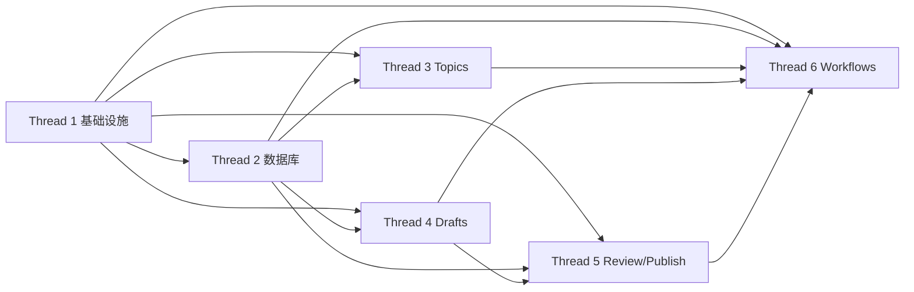

# Content Workbench 并行开发工作流拆分

## 1. 目标

本文档用于把 `Content Workbench` 拆成可以由多个 thread 并行推进的开发切片。

设计目标：

- 每个 thread 有明确写入边界
- 共享文件尽量少
- 依赖关系清晰，避免“还没定契约就先写实现”
- 每个 thread 都有独立可验收的交付物

## 2. 并行前提

只有在以下文档已经稳定后，才建议开多个 thread：

- [代码结构与模块边界](/Users/tao/Documents/repo/content-workbench/docs/architecture/codebase-layout.md)
- [领域状态机](/Users/tao/Documents/repo/content-workbench/docs/architecture/state-machines.md)
- [适配器接口约定](/Users/tao/Documents/repo/content-workbench/docs/architecture/adapters.md)
- [Jobs API](/Users/tao/Documents/repo/content-workbench/docs/api/jobs.md)
- [错误模型](/Users/tao/Documents/repo/content-workbench/docs/api/error-model.md)

## 3. 总体原则

- 先定契约，再开工实现
- 每个 thread 优先拥有一个垂直切片或一组稳定基础设施
- 共享目录必须有单一 owner
- 数据库 schema 改动串行处理，不允许多个 thread 同时改 Prisma 主 schema
- 页面层、API 层、workflow 层可以并行，但前提是都遵守相同契约

## 4. 推荐线程顺序

### Thread 1：项目骨架与基础设施

目标：

- 建立可运行仓库骨架
- 固化目录结构、基础工具链和共享开发体验

拥有目录：

- 根目录配置文件
- `src/app/` 下的全局壳与共享入口
- `src/lib/`
- `src/components/`
- `src/styles/`

允许修改：

- `package.json`
- `tsconfig.json`
- `biome.json`
- `next.config.*`
- `.env.example`
- `src/app/layout.tsx`
- `src/app/page.tsx`

不拥有：

- `prisma/`
- `src/server/domain/`
- `src/features/topics/`
- `src/features/drafts/`
- `src/features/review/`
- `src/features/publish/`
- `src/server/workflows/`

完成定义：

- Next.js 项目可启动
- `TypeScript strict` 生效
- `Biome`、`lint`、`typecheck`、测试命令具备入口
- 全局布局、路由壳、错误页、空状态壳具备

### Thread 2：数据库与数据访问基础层

目标：

- 落地 Prisma schema、迁移和基础数据访问层

拥有目录：

- `prisma/`
- `src/server/db/`
- `src/server/repositories/`

允许修改：

- `prisma/schema.prisma`
- `prisma/migrations/`
- `src/server/db/*`
- `src/server/repositories/*`

限制：

- 只提供 repository 和 query 能力，不写具体业务流程页面
- 对外暴露稳定查询接口，不让 feature 直接拼 Prisma 查询

完成定义：

- 核心实体 schema 落地
- 本地迁移、seed、重置流程可执行
- 提供 Topics、Drafts、Review、Publish 的基础 repository

### Thread 3：Topics 垂直切片

目标：

- 打通 Topics 页面、Topics API 和选题状态操作

拥有目录：

- `src/features/topics/`
- `src/app/(dashboard)/topics/`
- `src/app/api/topics/`

允许修改：

- Topics 相关 server actions、route handlers、UI 组件

依赖：

- Thread 1 完成基础 app 壳
- Thread 2 提供 `TopicCluster` 查询与写入接口

完成定义：

- Topics 列表页可读
- 选题详情和素材关联可读
- `shortlist`、`ignore`、`start` 动作可用
- “生成母稿”动作能正确触发 job

### Thread 4：Draft / Rewrite 垂直切片

目标：

- 打通母稿详情、改写版本、平台包装触发

拥有目录：

- `src/features/drafts/`
- `src/app/(dashboard)/drafts/`
- `src/app/api/drafts/`

允许修改：

- Draft 页面、改写操作、平台包装入口

依赖：

- Thread 1 的基础 app 能力
- Thread 2 的 `Draft` / `RewriteVersion` repository
- 共享 contract 文档已稳定

完成定义：

- Draft 详情页可读
- 改写任务可触发
- 改写版本可切换
- 平台包装任务可基于 mock 或 contract 触发并展示 job 状态

### Thread 5：Review / Publish 垂直切片

目标：

- 打通审核和发布准备主链路

拥有目录：

- `src/features/review/`
- `src/features/publish/`
- `src/app/(dashboard)/review/`
- `src/app/(dashboard)/publish/`
- `src/app/api/review/`
- `src/app/api/publish/`

依赖：

- Thread 1、2 基础完成
- Thread 4 能产生 `PACKAGED` 稿件

完成定义：

- 审核队列和审核详情可用
- 通过、退回、重新提交规则正确
- 发布包详情、导出、回填链接可用

### Thread 6：采集、生成、包装工作流与适配器

目标：

- 建立 `Trigger.dev` 工作流和外部能力适配层

拥有目录：

- `src/app/api/jobs/`
- `src/server/workflows/`
- `src/server/adapters/`
- `src/server/services/jobs/`

允许修改：

- ingestion、generation、rewrite、packaging、export、remote-draft workflows
- source / llm / storage / channel draft adapters

依赖：

- Thread 1 的基础配置
- Thread 2 的 repository 和 schema
- Thread 3、4、5 已经按 contract 暴露调用入口

完成定义：

- 热点采集工作流可单独运行
- 母稿生成、改写、包装、导出工作流都有统一输入输出
- job 状态能被 API 与前端消费
- 已存在的 mock 调用点可切换到真实 workflow，不破坏上层接口

## 5. 线程间依赖图

## 6. 共享文件锁

以下文件默认只能由单一 thread 修改：

- `package.json`
  默认由 Thread 1 拥有
- `prisma/schema.prisma`
  默认由 Thread 2 拥有
- `src/app/layout.tsx`
  默认由 Thread 1 拥有
- `src/server/contracts/*`
  默认由 Thread 1 或指定契约 owner 先建壳，后续谨慎修改

以下共享文件尽量不要出现：

- 全局 `index.ts` barrel
- 超大 `types.ts`
- 跨 feature 的工具杂物目录

## 7. 交接规则

一个 thread 在交付给下游 thread 之前，至少要提供：

- 文档里声明的接口或目录已存在
- 最小测试或 mock 可运行
- 对外暴露的函数签名已稳定
- 未完成部分明确标注 `TODO(owner)`

## 8. 联调节奏

建议每轮联调只做一个方向：

1. Thread 1 + 2 建底座
2. Thread 3 接 Topics 查询与状态流转
3. Thread 4 接 Draft 与 Rewrite
4. Thread 6 接入真实 workflow
5. Thread 5 最后收口审核与发布

不要一开始同时联调所有 thread。

## 9. 风险最高的冲突点

- Prisma schema 与迁移
- Job 状态结构
- Draft 状态机解释不一致
- 适配器接口字段漂移
- 全局路由和 layout 频繁调整

这些冲突必须通过文档先统一，不能在代码里碰运气解决。

## 10. Thread 与 Skills 映射

本文档中的 skill 建议分为两类：

- 主用 skill
  该 thread 开工时优先使用
- 辅助 skill
  只有在遇到对应问题时再调用

说明：

- `web-design-guidelines`
- `nextjs-react-typescript`
- `code-review-excellence`
- `qiaomu-design-advisor`
- `playwright-testing`

这些是后装 skill，通常需要在 Codex 重启后才能在新会话里稳定可用。

### Thread 1：项目骨架与基础设施

主用 skill：

- `brainstorming`
  在开工前收敛目录结构、共享约束、脚手架范围
- `Code`
  负责实际初始化、配置落地和命令打通
- `nextjs-react-typescript`
  约束 `Next.js + TypeScript strict` 项目骨架和常见实现模式

辅助 skill：

- `web-design-guidelines`
  用于全局 layout、导航壳、空状态和后台信息层级
- `Debugging`
  用于处理初始化失败、工具链冲突、命令跑不通

### Thread 2：数据库与数据访问基础层

主用 skill：

- `architecture-designer`
  用于校验 schema、repository 分层和数据访问边界
- `Code`
  负责 Prisma、repository、seed、迁移流程落地
- `Debugging`
  用于处理 schema、事务、migration、查询异常

辅助 skill：

- `code-review-excellence`
  用于检查 schema 改动是否引入状态或约束回归
- `openai-docs`
  仅当后续模型调用结果需要结构化入库格式时再使用

### Thread 3：Topics 垂直切片

主用 skill：

- `brainstorming`
  先收敛 Topics 页面的信息架构和操作流
- `qiaomu-design-advisor`
  优先用于 Topics 列表、筛选区、来源卡片、操作密度设计
- `Code`
  负责 Topics API、页面、状态动作实现

辅助 skill：

- `web-design-guidelines`
  用于后台列表页、筛选条、详情抽屉等通用 UI 规范
- `Debugging`
  用于处理列表查询、状态流转、job 触发异常
- `code-review-excellence`
  用于检查状态动作是否绕过守卫

### Thread 4：Draft / Rewrite 垂直切片

主用 skill：

- `brainstorming`
  用于收敛 Draft 页面结构、版本切换和改写入口
- `Code`
  负责 Draft API、版本切换、包装触发和详情页实现
- `Debugging`
  用于处理 rewrite、version selection、packaging job 的联调问题

辅助 skill：

- `qiaomu-design-advisor`
  用于设计母稿、改写版本对比和操作区布局
- `web-design-guidelines`
  用于编辑页密度控制、分栏与视觉层级
- `openai-docs`
  当接入模型生成、结构化输出或 prompt 相关能力时使用

### Thread 5：Review / Publish 垂直切片

主用 skill：

- `brainstorming`
  先梳理审核流、退回流、发布准备页交互
- `qiaomu-design-advisor`
  适合 Review 页面、Publish 页面、决策控件和状态卡片设计
- `Code`
  负责 Review / Publish API 与页面主链路实现

辅助 skill：

- `web-design-guidelines`
  用于高信息密度后台页的布局、按钮优先级和反馈设计
- `Debugging`
  用于处理审核门禁、发布记录回填、导出失败
- `code-review-excellence`
  用于检查审核门禁是否被绕过，发布状态是否回归

### Thread 6：采集、生成、包装工作流与适配器

主用 skill：

- `architecture-designer`
  用于 workflow 边界、adapter contract、失败与重试策略设计
- `Code`
  负责 Trigger.dev、adapter、job service 和 mock/real 实现切换
- `Debugging`
  用于处理异步 job、外部依赖、重试和幂等问题

辅助 skill：

- `openai-docs`
  接入 OpenAI 模型、结构化输出、图像能力时优先使用
- `agent-reach`
  研究采集源、网页读取、热点来源验证时使用
- `1password`
  管理模型密钥、存储凭证、渠道草稿系统凭证
- `code-review-excellence`
  检查 workflow 是否破坏状态机或引入重试风险
- `playwright-testing`
  当 workflow 已接入上层页面后，用于补跨页面主链路验证

## 11. 整体使用建议

- 开每个 thread 前，先用 `brainstorming` 或 `architecture-designer` 收敛边界，再进入 `Code`
- 一旦开始联调，优先切到 `Debugging`
- 页面 thread 优先组合：
  `brainstorming + qiaomu-design-advisor + web-design-guidelines + Code`
- 基础设施和 workflow thread 优先组合：
  `architecture-designer + Code + Debugging`
- 合并前 review 优先组合：
  `code-review-excellence + Debugging`
